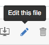
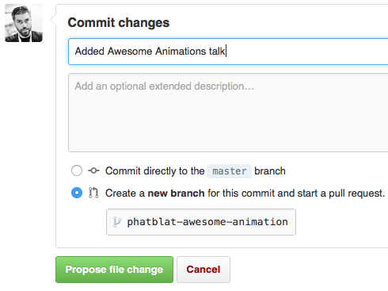

# 360iDev-Slides

A collection of links to slide decks and source code from talks at [360|iDev](http://360idev.com) in Denver, Colorado, USA.

- [2018](2018-Slides.md)
- [2015](2015-Slides.md)
- [2014](2014-Slides.md)

## Contributing

Want to add a link or fix a type? Great! Below is the easiest way to contribute.

1. Navigate to the file you want to modify in your browser (probably [2018-Slides.md](2018-Slides.md))
1. Click the "Edit this file" button 
1. Make your changes
   - Be sure to follow the format of the other entries
1. Use the "Commit changes" area to craft a fancy commit message
1. Be sure to create a new branch and start a pull request (all in one step!) 

## License

This repo is licensed under the MIT License. See the [LICENSE](LICENSE.md) file for rights and limitations.
